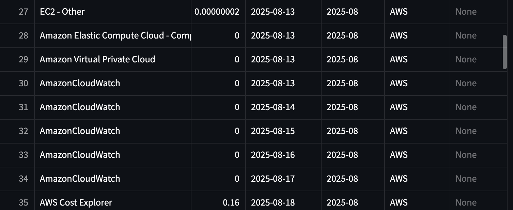

# Cloud Resource Scheduler

A lightweight automation tool to start, stop, and manage cloud resources (AWS, Azure, GCP) on custom schedules.  
It is designed to reduce costs, optimize resource usage, and provide fine-grained control with features like scheduling, manual triggers, and toggling.  
The application also analyzes cloud usage, detects idle or underutilized resources, and generates recommendations along with cost and utilization graphs.

---

## Features
- **Scheduled Actions** – Automatically start/stop resources based on custom time rules.  
- **Toggle Rules** – Enable or disable automation rules without deleting them.  
- **Instant Triggers** – Run rules immediately on demand.  
- **Multi-Cloud Support** – Works with AWS, Azure, and GCP resources.  
- **Resource Analysis** – Detects idle/underutilized resources and provides recommendations.  
- **Cost & Usage Insights** – Generates cost breakdowns, utilization graphs, and monitoring dashboards.  
- **Safe & Controlled** – Prevents accidental deletion while allowing temporary overrides.  

---

## Tech Stack
- **Language:** Python  
- **Framework:** Streamlit (Dashboard)  
- **Database:** PostgreSQL  
- **Cloud SDKs:** AWS SDK (boto3), Azure SDK, GCP SDK  
- **Deployment:** Docker, Kubernetes (optional)  

---

### Usage
- Launch the dashboard with streamlit run app/dashboard.py.
- Connect your AWS/Azure.
- Create a Rule – Define schedule, action (start/stop), and target resource.
- Toggle Rule – Enable/disable rules anytime.
- Trigger Now – Execute instantly when needed.
- Monitor – View cost graphs, idle resources, and recommendations.  

### Mock vs Real Data
- This project supports both mock data and real resource data:
- In aws_service.py and azure_service.py, set the flag:
  - True → Use mock data (ensures graphs and dashboards are always populated).
  - False → Use real resource data (requires active AWS/Azure credentials).

- This allows anyone to run the project locally without needing active cloud resources, while still being able to switch to real data when available.
- The screenshots below demonstrate real AWS data as proof, while mock mode ensures a consistent demo experience.

### Screenshots 
### 1. Resouces on AWS
<p align="center">
  
</p>

<p align="center">
  
</p>

### 2. Idle Resources
<p align="center">
  
</p>

### 3. Cost Dashboard
<p align="center">
  
</p>

<p align="center">
  
</p>

### 4. Cost Graph
<p align="center">
  
</p>

<p align="center">
  
</p>

## Getting Started

### Prerequisites
- Python (>= 3.9)  
- pip (Python package manager)  
- Docker (optional, for containerized deployment)  
- Cloud credentials (AWS, Azure)

### Installation
```bash
# Clone repo
git clone https://github.com/singhsayan/cloud-resource-scheduler.git
cd cloud-resource-scheduler

# Create virtual environment
python3 -m venv venv
source venv/bin/activate   # On Windows: venv\Scripts\activate

# Install dependencies
pip install -r requirements.txt

# Run application
streamlit run app/dashboard.py
```
